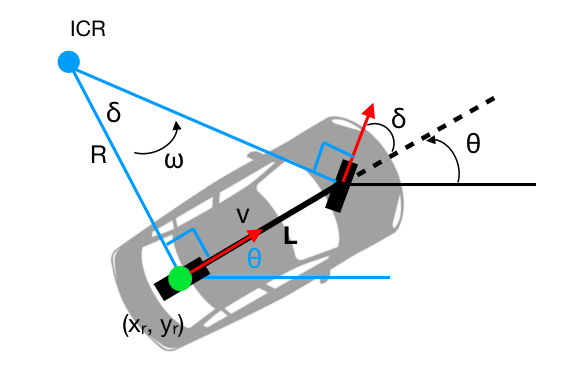
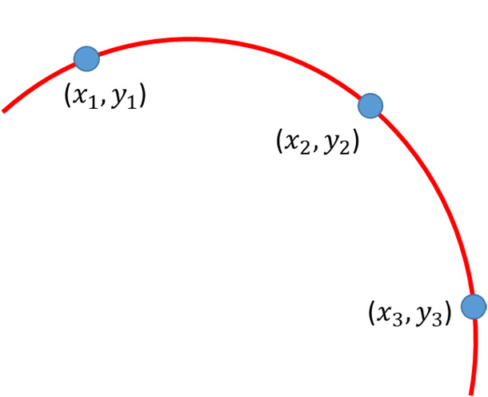

# Creating steering wheel angle to wheel angle map

Accurately measuring the angle of a wheel is a challenging task, especially due to the Ackermann steering geometry, which causes each wheel to have a different angle.
Moreover, the angle of one wheel may not accurately reflect the turning curvature of the vehicle. Measuring the angle of the steering wheel is relatively easier, but it does not provide a direct measure of the vehicle's turn radius.
This article aims to develop a map that correlates the steering wheel angle with the wheel angle of a bicycle model.

> Bicycle Kinematics

- R = L / tan(δ)
- δ: the wheel angle
- R: curvature radius
- L: Distance between front and rear axle

 > A Circle Passing Through 3 Points

To make a map, drive your vehicle to an open, wide, and smooth area. Set the steering wheel angle to a certain value and maintain it. Take the first measurement of the odometer's x and y values.(Lower position error makes result best, using RTK is highly recommended)
After driving half of the route, take the second measurement. 
Finally, take the third measurement at the end of the route. It's not necessary to complete a full circle.

- Fill the table below for each Steering Wheel Angle. 

| Steering Wheel Angle | P1x | P1y | P2x | P2y | P3x | P3y |
| --- | --- | --- | --- | --- | --- | --- |
| SteeringWheelAnge[0]|------|------|------|------|------|----- |
| SteeringWheelAnge[*]|------|------|------|------|------|----- |
| -------------------------|------|------|------|------|------|----- |

- This matlab script takes measurements and creates maps
[Steering map](https://github.com/leo-drive/Steering-Map)
